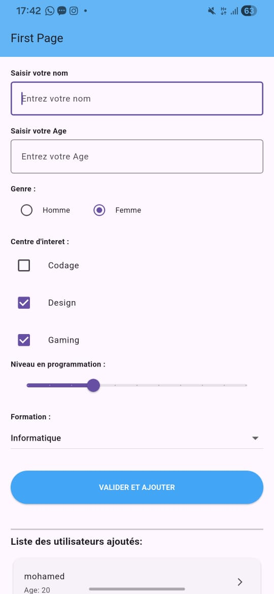
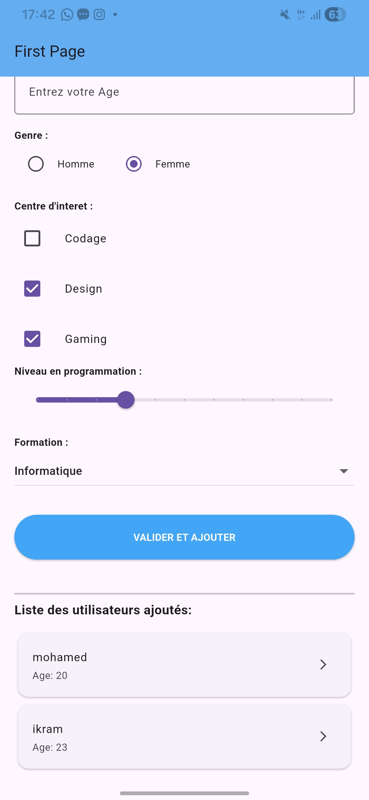
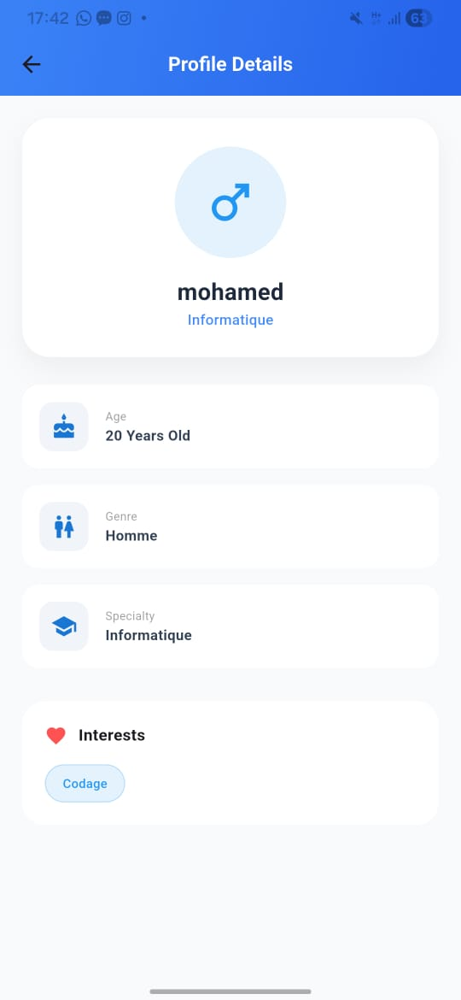
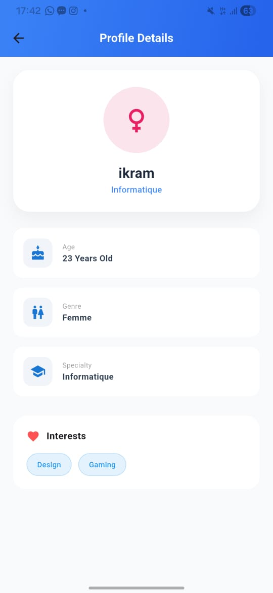

# Application Formulaire & Répertoire Utilisateurs (Flutter)

Ce projet est une application Flutter permettant de capturer des informations via un formulaire dynamique, de les sauvegarder localement dans une liste, et de consulter les détails de chaque profil.

##  Origine du projet
Le développement de ce formulaire a été réalisé en s'appuyant sur les tutoriels suivants :
- **Vidéo 1** : [https://youtu.be/j5NXqMOY1l8]
- **Vidéo 2** : [https://youtu.be/ezSiPm2rNNk]
## Merci à Monsieur EL MERNISSI ABDERAZZAK.
##  Fonctionnalités ajoutées
En plus du formulaire de base, j'ai implémenté plusieurs fonctionnalités avancées :
1. **Système de Sauvegarde** : Ajout d'une logique permettant d'enregistrer les données dans une liste dynamique.
2. **Navigation & Détails** : Mise en place d'un passage de données entre écrans. En cliquant sur un utilisateur, l'application affiche une page de profil détaillée.
3. **Design Moderne** : Interface utilisateur soignée avec des dégradés, des cartes (Cards) et une mise en page responsive.

##  Explication technique : La Liste de Sauvegarde
Pour gérer l'affichage et la sauvegarde des utilisateurs, j'ai utilisé une approche structurée :

- **Le Modèle de Données (Class User)** : J'ai créé une classe `User` pour structurer chaque profil (nom, âge, genre, intérêts, etc.).
- **La Liste Dynamique (`List<User>`)** : Une liste vide est initialisée dans l'état de l'application. 
- **Mise à jour de l'UI (`setState`)** : Lors du clic sur le bouton "VALIDER", une nouvelle instance de `User` est créée avec les données saisies et ajoutée à la liste via `userList.add()`. L'appel à `setState()` demande à Flutter de reconstruire l'interface pour afficher instantanément le nouvel élément dans le `ListView.builder`.
- **Navigation (Passing Data)** : Pour la page détails, l'objet `User` spécifique est passé en paramètre au constructeur de la page suivante, permettant un affichage dynamique des informations.

##  Aperçu
- **Page Principale** : Formulaire complet avec `TextField`, `Radio`, `Checkbox`, `Slider` et `Dropdown`, suivi de la liste des inscrits.
- **Page Détails** : Vue optimisée du profil sélectionné.
##  Captures d’écran 

  
  
  

---
Développé par **Mohamed Lamafer**
